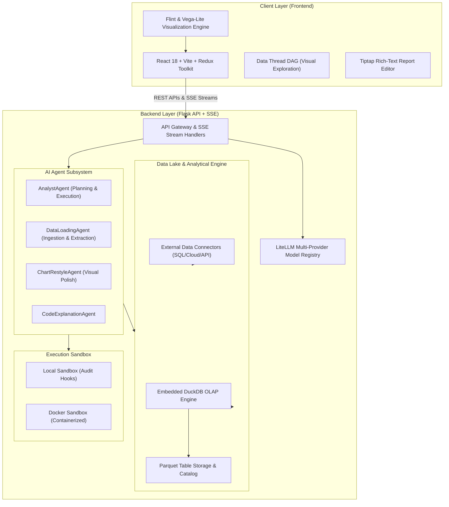
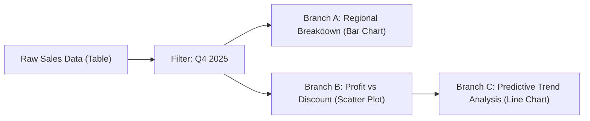
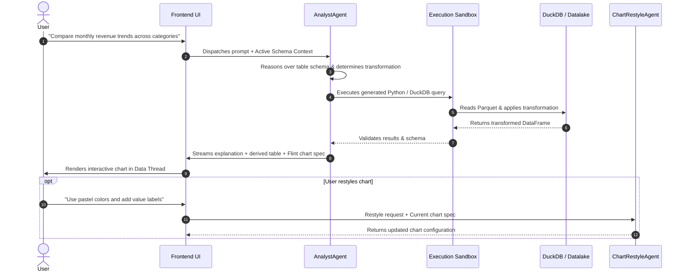

# Microsoft InsightCanvas: Complete Architecture & User Guide

**InsightCanvas** is an AI-powered interactive data analysis and visualization platform developed by **Microsoft Research**. It blends natural language intent with rich graphical UI interactions, allowing analysts, data scientists, and business users to transform messy data, discover insights through branching exploration threads, customize charts, and formulate rich analytical reports.

---

## 1. System Architecture Overview

InsightCanvas follows a decoupled client-server architecture with an embedded high-performance analytical engine and a multi-agent AI subsystem.



---

## 2. Complete Technology Stack

### Frontend (Client-Side)
| Category | Technology | Purpose |
|---|---|---|
| **Core Framework** | React 18 & TypeScript 5.9 | Reactive component lifecycle and type safety |
| **Build Tooling** | Vite 7 & ESBuild | Ultra-fast Hot Module Replacement (HMR) and bundling |
| **State Management** | Redux Toolkit (`@reduxjs/toolkit`) & `redux-persist` | Centralized state management for tables, charts, threads, and UI sessions |
| **Component Library** | Material-UI (MUI v7), Emotion, SCSS | Modern enterprise design system and styling tokens |
| **Visualization Engines** | **[Flint](https://microsoft.github.io/flint-chart/)**, Vega, Vega-Lite, ECharts, Chart.js | Declarative, semantic chart generation and interactive visual encodings |
| **Report Authoring** | Tiptap (ProseMirror), KateX, PrismJS | Interactive document editing with live chart embeddings and syntax highlighting |
| **Layout & Drag-and-Drop** | Allotment, React-DnD, React-Virtuoso | Resizable split-pane layout, drag-and-drop shelf mapping, virtualized lists |
| **Internationalization** | i18next & `react-i18next` | Multilingual UI support (English and Chinese out of the box) |

---

### Backend (Server-Side)
| Category | Technology | Purpose |
|---|---|---|
| **API Framework** | Python 3.11+ & Flask | Lightweight RESTful services and Server-Sent Events (SSE) streaming |
| **Embedded OLAP DB** | **DuckDB** | Columnar in-memory analytical query processing and SQL execution |
| **Data Processing** | Pandas, NumPy, PyArrow, Scikit-learn | In-memory data structures, data wrangling, and ML utilities |
| **LLM Orchestration** | **LiteLLM** & OpenAI SDK | Unified interface across OpenAI, Azure OpenAI, Anthropic Claude, Ollama, Gemini, Groq |
| **Web Scraping & Browser**| Playwright & BeautifulSoup4 | Headless browser execution for scraping dynamic tables from URLs |
| **Security & Sandboxing** | Python `sys.addaudithook` & Docker | Hardened code execution isolation to prevent malicious operations |
| **Authentication & Session**| PyJWT, MSAL Browser, Flask-Session (Cachelib) | OIDC, Entra ID SSO, and server-side encrypted session tokens |

---

## 3. End-to-End User Guide: How to Use InsightCanvas

### Step 1: Ingesting & Connecting Data
InsightCanvas provides a unified ingestion dialog:
1. **Local Files**: Drag-and-drop `.csv`, `.xlsx`, `.xls`, `.tsv`, `.json`, or `.parquet` files.
2. **Databases & Warehouses**: Connect directly to **PostgreSQL**, **MySQL**, **MSSQL (SQL Server)**, **ClickHouse**, **Google BigQuery**, **Databricks SQL**, **AWS Athena**, **Azure CosmosDB / Kusto**, or **MongoDB**.
3. **Images & Screenshots**: Paste a screenshot or photo containing a table or chart. The `DataLoadingAgent` parses the image and converts it into a structured dataset.
4. **Web URLs**: Enter a web page URL; the backend automatically renders the DOM and scrapes tabular structures into tables.

---

### Step 2: The "Data Thread" Visual Exploration
Unlike standard chatbots where past context is lost in a vertical chat history, InsightCanvas introduces **Data Threads**:
* **Branching Analysis (DAG)**: Every question or transformation creates a card on the canvas.
* **Hypothesis Testing**: You can branch off from any point in the thread to explore alternative ideas without overwriting previous steps.
* **Transformation Transparency**: The AI generates explicit Python/SQL transformations, which you can inspect, edit, and verify.



---

### Step 3: Visual Encodings & Chart Generation
* **Automatic Chart Synthesis**: When asking questions in natural language (e.g. *"Show revenue by product category over time"*), the AI synthesizes both the transformed dataset and the chart specification.
* **Flint Semantic Visual Language**: InsightCanvas uses [Flint](https://microsoft.github.io/flint-chart/) to generate concise, publication-quality visualizations with automatic scales, legends, and layouts.
* **Manual Drag-and-Drop Encodings**: You can manually map columns to visual channels (X-axis, Y-axis, Color, Size, Row/Column facets) on the encoding shelf.

---

### Step 4: Conversational Restyling & Polish
* Click the **Restyle** button on any chart.
* Prompt the `ChartRestyleAgent` with stylistic instructions:
  * *"Switch to a dark modern palette"*
  * *"Sort bars in descending order and highlight the top 3"*
  * *"Add trendlines and format the Y-axis as currency in millions ($M)"*

---

### Step 5: Report Authoring & Sharing
* Move selected insights and charts into the **Report View**.
* Use the **Tiptap Rich-Text Editor** to draft an analytical memo.
* Embed live interactive charts directly into paragraphs.
* Export reproducible Python scripts, Vega specifications, or shareable workspaces.

---

## 4. AI Multi-Agent Subsystem Architecture

InsightCanvas breaks down complex analytical workflows into specialized autonomous agents:



---

## 5. Security, Isolation & Sandboxing

Because AI agents write and execute code on the fly, InsightCanvas enforces a multi-tier security model:

1. **Local Sandbox (Default)**:
   * Runs in a warm Python subprocess.
   * Utilizes Python `sys.addaudithook` to block unauthorized system calls (file system write outside sandbox, network socket creation, sub-process execution, `shutil.rmtree`, etc.).
   * Overhead: `< 1ms`.
2. **Docker Sandbox (`SANDBOX=docker`)**:
   * Spins up disposable containerized runtimes for multi-tenant environments.
   * Mounts workspaces read-only and enforces strict CPU/Memory/PID constraints.
3. **HMAC Code Signing**:
   * Resulting code and transformations are cryptographically signed server-side to prevent tampering before execution.
4. **SSRF Allowlisting**:
   * Outbound custom LLM base URLs and web scraper targets are validated against an allowlist to prevent Server-Side Request Forgery.

---

## 6. Project Quick Reference

### Instant Control Scripts
* **`setup.bat`**: Installs `uv`, `yarn`, backend Python dependencies (`.venv`), frontend node modules (`node_modules`), and sets up `.env`.
* **`start.bat`**: Launches the Flask backend on port `5567` and Vite dev server on port `5173`, opening `http://localhost:5173`.
* **`stop.bat`**: Gracefully kills running server processes on ports `5567` and `5173`.

### Directory Map
```
InsightCanvas/
├── py-src/data_formulator/       # Python Backend Source
│   ├── agents/                   # Specialized AI Agents & Prompt Templates
│   ├── analyst/                  # Central AnalystAgent & Tool Definitions
│   ├── data_loader/              # Database & Cloud Storage Connectors
│   ├── datalake/                 # DuckDB & Parquet Workspace Storage
│   ├── routes/                   # Flask REST API & Streaming Endpoints
│   ├── sandbox/                  # Local & Docker Code Execution Sandboxes
│   └── app.py                    # Flask Application Entry Point
├── src/                          # TypeScript / React Frontend Source
│   ├── app/                      # Redux Store, Tokens, Layout Providers
│   ├── components/               # Reusable UI Widgets & Catalog Trees
│   ├── views/                    # DataThread, VisualizationView, ReportView
│   └── index.tsx                 # Frontend Entrypoint
├── .env                          # Local Environment & API Keys Configuration
├── setup.bat                     # Full automated setup script
├── start.bat                     # One-click start script
└── stop.bat                      # One-click stop script
```
